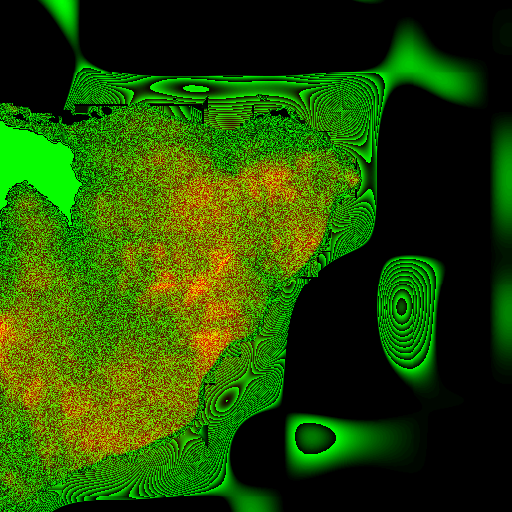

# 🚙 Montauk Ranger

A browser-based 3D driving game where you patrol **Montauk Point, NY** as a park ranger.
The level is built from **real topographical data** of the Montauk peninsula, with an art
direction inspired by **Firewatch** — bold warm dusk palette, flat-shaded low-poly terrain,
distance-ramped colored fog, and a gradient sky that the land dissolves into at the horizon.



## Play

It's plain HTML + CSS + ES modules (Three.js via CDN import map) — **no build step**.
Serve the folder over HTTP (ES modules and `fetch` don't work from `file://`):

```bash
npm start          # python3 -m http.server 8080
# then open http://localhost:8080/
```

**Controls:** `W A S D` or arrow keys to drive, `Space` to brake. Drive to the lighthouse,
the Camp Hero radar tower, and the ranger lookout to log them.

## Real topography

The terrain is generated from **AWS Terrain Tiles** (Mapzen/OpenTopography "Terrarium"
RGB-encoded elevation, public domain, no API key), sampled over the Montauk Point bounding
box and baked into static assets:

| Asset | What it is |
| --- | --- |
| `assets/baked/heightmap.png` | Elevation packed into the R (high byte) + G (low byte) channels |
| `assets/baked/heightmap.meta.json` | Grid size, bbox, min/max elevation, meters-per-pixel, world size |
| `assets/baked/roads.geojson` | Road/trail network + landmark points, pre-projected to local meters |
| `assets/baked/manifest.json` | Data provenance (real DEM vs procedural fallback) |

The runtime never hits the network for map data — everything is baked.

### Re-baking the data

```bash
npm install        # dev dependency: pngjs (used only by the bake scripts)
npm run bake       # downloads Terrarium tiles + writes heightmap, then bakes roads
```

- `tools/prefetch.mjs` downloads the Terrarium elevation tiles covering the Montauk bbox
  (`tools/lib/tilemath.mjs` for slippy/Web-Mercator math, `tools/lib/terrarium.mjs` to
  decode + stitch them), crops to the area of interest, downsamples, and writes the
  heightmap. If the elevation host is unreachable it falls back to a procedurally generated
  Montauk-shaped heightmap and flags `manifest.real = false` (the HUD then shows a
  "PLACEHOLDER TERRAIN" badge).
- `tools/bake-roads.mjs` projects the Montauk road/trail network and landmarks (lighthouse,
  Camp Hero radar tower, ranger lookout) from real lat/lon into the same local-meter space
  as the terrain. The OSM Overpass API is blocked in some sandboxes, so this network is
  authored from real coordinates; swapping in a live Overpass fetch is a drop-in change.

## Architecture

```
index.html            entry: import map + canvas + HUD overlay
css/game.css          HUD + loading screen
src/
  main.js             bootstrap: load data, build scene, run the drive loop
  config.js           one place for bbox-derived scales, palette, vehicle/camera tuning
  world/
    DataLoader.js     loads + decodes the baked assets
    HeightField.js    bilinear terrain height + slope-normal sampling (drives physics)
    Terrain.js        heightmap -> flat-shaded low-poly mesh + sea plane
    Roads.js          GeoJSON -> ribbon meshes draped on the terrain
    PointsOfInterest.js  low-poly lighthouse / radar tower / lookout at real coords
    Sky.js            gradient sky dome (horizon matches the far-fog color)
  render/
    FogRamp.js        Firewatch distance-color fog (Material.onBeforeCompile patch)
    Lighting.js       warm dusk key light + sky/ground hemisphere
  vehicle/
    Vehicle.js        arcade ground-following truck physics
    Input.js          keyboard state
    ChaseCamera.js    spring-damped chase camera
  ui/
    Hud.js            speed, objectives, POI prompts, data-provenance badge
    Loading.js        loading-screen controller
tools/                data bake pipeline (Node, dev-only)
```

## Credits / data

- Elevation: [AWS Terrain Tiles](https://registry.opendata.aws/terrain-tiles/) (Terrarium),
  derived from public-domain sources (USGS 3DEP, SRTM, et al.).
- Rendering: [Three.js](https://threejs.org/).
- Art direction inspired by [Firewatch](https://www.firewatchgame.com/) (Campo Santo).
